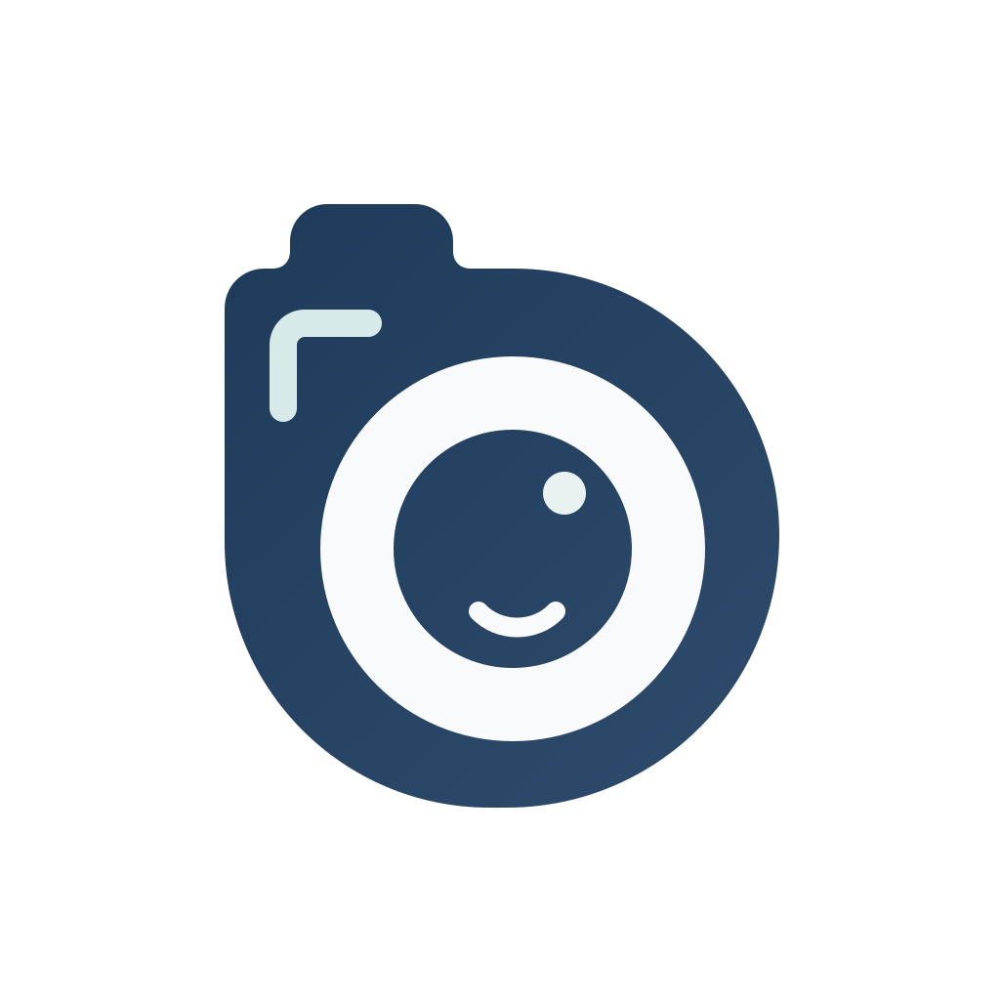
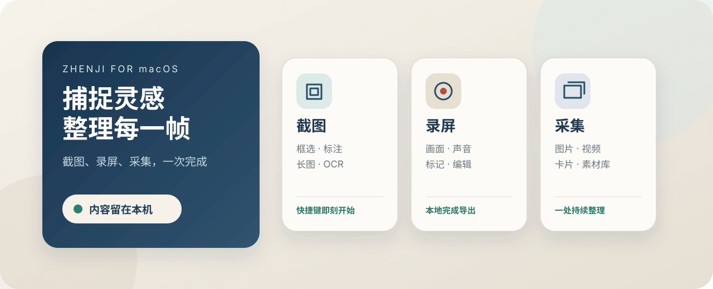

<p align="center">
  
</p>

<h1 align="center">帧集</h1>

<p align="center">
  为 macOS 打造的本地截图、录屏与素材采集工具。
  <br>
  从捕捉、编辑到整理，让一次工作在同一条流程里完成。
</p>

<p align="center">
  macOS 15+ &nbsp;·&nbsp; Apple Silicon &nbsp;·&nbsp; 本机处理 &nbsp;·&nbsp; 公开测试版
</p>

<p align="center">
  <a href="https://github.com/AidenXu-1/Zhenji/releases/latest"><strong>下载最新版本</strong></a>
  &nbsp;·&nbsp;
  <a href="#下载与安装">安装说明</a>
  &nbsp;·&nbsp;
  <a href="PRIVACY.md">隐私说明</a>
  &nbsp;·&nbsp;
  <a href="SUPPORT.md">问题反馈</a>
</p>



## 捕捉、编辑、整理，一条本地工作流

帧集把截图、录屏和临时素材收集放进同一个 macOS 应用。高频操作从快捷键开始，结果可以直接复制、保存、继续编辑或集中放入采集板，减少在多个工具之间来回切换。

| 截图 | 录屏 | 采集卡与采集板 |
| --- | --- | --- |
| 区域、窗口、全屏和上次范围 | 全屏、窗口和自定义区域 | 图片、视频、音频、文本与常用文件 |
| 标注、圆角、阴影和固定截图 | 系统声音、麦克风和摄像头 | 文件夹、压缩包与混合素材收集 |
| 滚动长图、OCR、二维码与本地图片翻译 | 暂停继续、录中标记与范围提示 | 筛选、Quick Look、批量复制和拖出 |
| 快速复制、保存或加入采集板 | 本地编辑、自动缩放与导出 | 扇形浏览、键盘操作与手动清空 |

## 0.2.1 有什么新变化

- 自定义区域录屏开始后会持续显示边界，让正在录入的范围始终清楚可见。
- 录制控制条改为更紧凑的深墨色胶囊，重新梳理计时、暂停、停止和放弃的操作层级。
- 录制边界和控制条均支持 macOS 的“减少透明度”与“减少动态效果”。

[查看完整版本说明](https://github.com/AidenXu-1/Zhenji/releases/tag/v0.2.1)

## 下载与安装

当前公开版本为 **0.2.1 (3)**，支持 **macOS 15 或更高版本**和 **Apple Silicon Mac**。

<p>
  <a href="https://github.com/AidenXu-1/Zhenji/releases/download/v0.2.1/Zhenji-0.2.1-macOS-arm64.dmg"><strong>下载 DMG（推荐）</strong></a>
  &nbsp;·&nbsp;
  <a href="https://github.com/AidenXu-1/Zhenji/releases/download/v0.2.1/Zhenji-0.2.1-macOS-arm64.zip">下载 ZIP</a>
  &nbsp;·&nbsp;
  <a href="https://github.com/AidenXu-1/Zhenji/releases/latest">查看最新 Release</a>
</p>

1. 打开 DMG，把“帧集”拖入“应用程序”。
2. 首次启动若被 macOS 拦截，进入“系统设置 → 隐私与安全性”，在“安全性”区域点击“仍要打开”。
3. 按应用内引导授予屏幕录制权限；只有使用对应功能时，才需要麦克风或摄像头权限。
4. macOS 授权后若功能没有立即生效，请退出并重新打开帧集。

> 当前公开测试版使用临时签名，尚未使用 Developer ID，也没有经过 Apple 公证。因此 Gatekeeper 不会直接放行，首次启动可能需要“仍要打开”。这与屏幕录制、麦克风和摄像头权限是两套独立授权。

## 本机处理与权限

- 无需注册账户，不包含广告、行为分析或遥测上报。
- 截图、录屏、OCR、二维码识别和图片翻译默认在用户的 Mac 上处理。
- 用户内容不会由帧集主动上传；图片翻译所需的语言资源可能由 macOS 首次准备。
- 屏幕录制、麦克风和摄像头权限均由 macOS 管理，可随时在“系统设置 → 隐私与安全性”中撤销。

详细的数据与剪贴板边界见 [隐私说明](PRIVACY.md)。提交公开问题前，请遮挡账号、聊天内容、文件路径和其他敏感信息。

## 当前支持边界

- 仅支持 Apple Silicon Mac，Intel Mac 暂未列入支持范围。
- 当前以单显示器工作流为稳定范围；跨显示器、混合缩放比例和二维滚动拼接仍在完善。
- 动态变化或虚拟化程度很高的网页，滚动长图可能需要手动调整。

更多说明见 [已知限制](KNOWN_ISSUES.md)。

<details>
<summary><strong>校验下载文件</strong></summary>

下载同一版本的 `SHA256SUMS.txt` 后，在文件所在目录执行：

```bash
shasum -a 256 -c SHA256SUMS.txt
codesign --verify --deep --strict --verbose=4 /Applications/帧集.app
```

校验和用于确认下载文件字节一致；`codesign` 用于检查 App 包体签名完整性。两者都不代表 Apple 公证或 Gatekeeper 信任。

</details>

## 关于这个仓库

此仓库是帧集的**公开下载与支持页面**，用于提供安装包、版本说明、校验和及问题反馈。仓库不包含产品源码，也不以开源许可证发布。

遇到问题时，请先查看 [已知限制](KNOWN_ISSUES.md)，再通过 [GitHub Issues](https://github.com/AidenXu-1/Zhenji/issues) 提交可复现信息。
